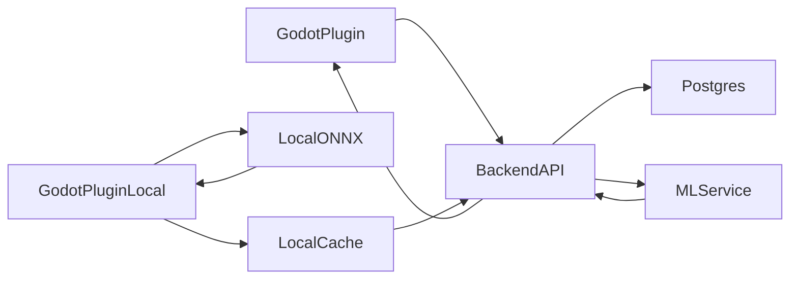

# Архитектура API и БД (минимальный контракт)

## Цель

Сделать так, чтобы **плагин всегда ходил в один Backend API**, а уже Backend:

- пишет телеметрию в Postgres;
- при необходимости вызывает **ML-service**;
- возвращает клиенту **adaptation payload**;
- поддерживает **офлайн** через локальный ONNX inference в плагине.

---

## Endpoints Backend API (FastAPI)

### 1) Сессии (уже есть)

- **`POST /game/session/start`**
  - **вход**: `player_id`, `game_version?`
  - **выход**: `session_id`, `started_at`, `player_id`
- **`PATCH /game/session/{session_id}/end`**
  - **выход**: финальная сессия

### 2) Инжест телеметрии

Сейчас есть `POST /game/events` — это ок, но для архитектуры «API → ML-service» удобнее единый ingest, который:

- сохраняет события;
- обновляет агрегаты/фичи;
- триггерит prediction при достижении порога (например, 10 первых действий);
- возвращает адаптацию в ответе (опционально).

**Рекомендация:**

- **`POST /telemetry/ingest`**
  - **вход**:
    - `game_id`
    - `events[]` (session_id, player_id, event_name, timestamp, parameters, state)
    - `metadata` (game_profile, critical_points, archetypes, model_mode)
  - **выход**:
    - `events_received`
    - `prediction?`
    - `adaptation?`

*Если не хотите добавлять новый endpoint — можно расширить `POST /game/events`, но логически ingest лучше отделить от «чистого CRUD events».*

### 3) Получение адаптации клиентом

- **`GET /game/adaptation/{session_id}`** (уже есть)
  - **выход**: актуальные параметры адаптации для сессии
- (опционально) **`GET /game/adaptation/{session_id}/poll`**
  - если расчёт асинхронный (для диплома можно синхронно)

### 4) Управление профилем игры (задаёт разработчик)

- **`PUT /games/{game_id}/profile`**
  - **вход**: `critical_points[]`, `archetypes[]`, `feature_schema_version`, `bootstrap_actions` (например 10)
  - **выход**: `profile_version`
- **`GET /games/{game_id}/profile`**
  - **выход**: актуальный профиль

### 5) Модель (манифест и скачивание) — офлайн в плагине

- **`GET /games/{game_id}/model/manifest`**
  - **выход**:
    - `model_version`
    - `feature_schema_version`
    - `format: "onnx"`
    - `sha256`
    - `download_url`
    - `created_at`
- **`GET /games/{game_id}/model/download?version=...`**
  - отдаёт `.onnx` файл

### 6) Отладка / аналитика (минимально)

- **`GET /sessions/{session_id}/prediction/latest`**
- **`GET /players/{player_id}/history`** (опционально)

---

## Endpoints ML-service (внутренние, не для клиента)

Backend ходит сюда по внутренней сети docker-compose.

### 1) Предсказание

- **`POST /predict`**
  - **вход**:
    - `game_id`
    - `session_id`
    - `player_id`
    - `features` (подготовленные backend’ом или ML-service считает из событий)
    - `model_version?`
  - **выход**:
    - `predicted_archetype`
    - `confidence`
    - `recommended_adaptation` (dict для клиента)
    - `model_version`

### 2) Обучение / дообучение

- **`POST /train`**
  - **вход**: `game_id`, `from_time?`, `to_time?`, `profile_version?`
  - **выход**: `new_model_version`
- **`GET /model/manifest?game_id=...`** (если модель хранится в ML-service)
- альтернатива: модели в Backend, ML-service только генерирует и отдаёт бинарь Backend’у

---

## Таблицы в Postgres (минимальный набор)

Уже есть: `players`, `sessions`, `events`, `adaptation_state`.

### 1) `game_profiles`

- **назначение**: архетипы, критические точки, схема признаков (задаёт разработчик)
- поля:
  - `game_id` (PK)
  - `profile_version`
  - `critical_points` (JSONB)
  - `archetypes` (JSONB)
  - `feature_schema_version` (int)
  - `bootstrap_actions` (int, например 10)
  - `updated_at`

### 2) `session_features` (или `training_samples`)

- **назначение**: агрегированные признаки для обучения
- поля:
  - `id` (PK)
  - `game_id`
  - `session_id` (FK)
  - `player_id` (FK)
  - `feature_schema_version`
  - `features` (JSONB)
  - `created_at`

### 3) `predictions`

- поля:
  - `prediction_id` (PK)
  - `game_id`
  - `session_id`
  - `player_id`
  - `predicted_archetype`
  - `confidence`
  - `model_version`
  - `details` (JSONB)
  - `created_at`

### 4) `model_registry`

- поля:
  - `game_id`
  - `model_version`
  - `feature_schema_version`
  - `format` (`onnx`)
  - `sha256`
  - `storage_path` или `download_url`
  - `created_at`
- индексы: `(game_id, created_at desc)`, `(game_id, model_version)`

### 5) `adaptation_state` (расширить)

- добавить:
  - `model_version`
  - `predicted_archetype`
  - `confidence`
  - `source` (`cloud` / `local`)
  - `updated_at`

---

## Два режима работы

### Cloud mode (онлайн)

1. Плагин шлёт события в **Backend** (`/telemetry/ingest`).
2. Backend сохраняет `events`.
3. Backend считает признаки или вызывает ML-service (feature + predict).
4. ML-service возвращает `prediction + recommended_adaptation`.
5. Backend пишет `predictions`, `adaptation_state`, (опционально) `session_features`.
6. Backend отдаёт `adaptation` в ответе или клиент забирает через `/game/adaptation/{session_id}`.

### Local mode (офлайн)

1. Плагин копит события локально.
2. После первых 10 действий:
   - строит `features` по `feature_schema_version`;
   - inference ONNX;
   - применяет адаптацию локально.
3. При появлении сети — батч событий в Backend, опционально «local_prediction» для сравнения.

---

## Советы по реализации

- Не делать «нейросеть сама определит архетипы» на старте: разработчик задаёт архетипы, система **классифицирует**.
- Одна схема признаков, контракт `feature_schema_version=1`.
- Дообучение — **на сервере**, запуск вручную или по расписанию (`POST /train`).

---

## Сервер: 3 контейнера

| Контейнер   | Роль |
|------------|------|
| **API**    | Единая точка входа для плагина, Postgres, вызов ML-service |
| **DB**     | Postgres: телеметрия, сессии, предсказания, адаптация, фичи |
| **ML-service** | Обучение, дообучение, инференс, версии моделей |

Локально у разработчика — только **плагин Godot**.

---

## Локальная модель (офлайн)

**Да, возможно** отдавать на клиент обученную модель для локального предсказания без интернета (ПК + ONNX).

### Доставка модели

- **Вариант A**: `.onnx` в комплекте с плагином (дефолт).
- **Вариант B**: `GET /games/{game_id}/model/manifest` + скачивание в `user://models/<game_id>/<version>/model.onnx`.

### Версионирование

- `model_version`
- `feature_schema_version`
- `game_profile_version` (критические точки / архетипы)

### Ограничение

- **Дообучение** — на сервере; на клиенте только **inference**.

---

## Выбор: где хранить модели

- **Вариант A**: Backend хранит `model_registry` и раздаёт `.onnx`; ML-service тренирует и предсказывает.
- **Вариант B**: ML-service хранит и раздаёт модели; Backend проксирует манифест/скачивание.

Оба рабочие; влияет на расположение endpoints `/model/*` и хранение файлов.

---

## Схема потоков

